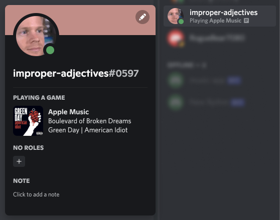

<h1 align="center">

Apple Music Presence

</h1>

Connect Apple music with Discord!

We all have friends who have Spotify (gross), but it shows what they are listening to in Discord! Being an apple music user, I felt left out so implemented it myself!

## Features

- Easy startup
- Extremely lightweight
- No API keys required
- No dependencies
- Easy setup
- Display song name
- Display album art
- Display artist name
- Display album name

## Alternatives

### Apple-Music-RPC

https://github.com/rohilpatel1/Apple-Music-RPC

This app requires you to have python and nodejs installed and configured, as well as needing you to run command-line scripts to make it executable.

Cannot display album art.

### iTunes Rich Presence

https://itunesrichpresence.com/

There is only a windows version availible.

Cannot display album art.
